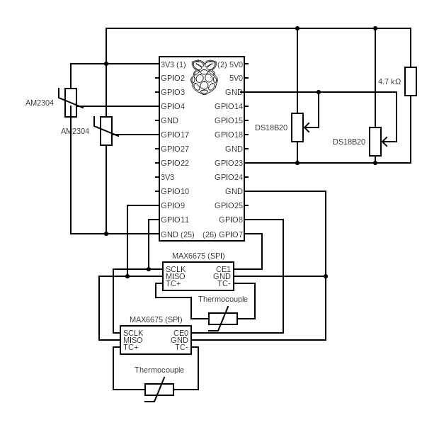

# ThermoPI-Furnace

Use a Raspberry PI connected to one or more temperature sensors to send the results to a MQTT server.

## USAGE

Install the program into opt/ThermoPI-Furnace or any suitable location. (Some people like /usr/local/bin instead of /opt) Make sure the username that is going to be running this script has access to the files and is able to get at python and anything else needed and used here-in.

You will need to rename the file ***MYsecretsSample.yaml*** to ***MYsecrets.yaml***.
Edit the contents of the new ***MYsecrets.yaml*** to match your MQTT & Home Assistant installation and requirements. You will also need to supply the full path to the secrets file in the **Get the parameter file** section of this python code around line 225.

This program grabs the 2nd half of the MAC address to use as the device ID. This only works consistently when there is only 1 Ethernet interface configured or you have your multiple interfaces cloned to the same MAC Address. For instance if it boots from WIFI, it will grab that MAC, and if it uses the Ethernet cable or a USB interface, it will grab that MAC. You get my point. This can be avoided by hard coding the DeviceID with the random and unique number of your choice. Also I have not tested this with IP6 addresses. If you have solutions to any of this, please share.

## AUTO-Start

Here is a good reference on setting up a program to run from systemd. Use it to get familiar with the process.

[How-To Geek on 'Startup With Systemd'](https://www.howtogeek.com/687970/how-to-run-a-linux-program-at-startup-with-systemd/)

To run the program at boot in order to get constant readings, there is the ThermoPIFurnace.service to run this as a service with load-service.sh there to set it up as a service.

The load-service.sh script will stop and scratch reload the service from the local repository (Once you get all the permissions happy).

The furnRestart.sh is the script to quickly restart the process if needed during troubleshooting. I found it helpful.

## Requirements

Program requirements (as written):  (Feel free to fork it & update the obsolete DHT Libraries to CircuitPython DHT Libraries and dropping me a merge request...)

+ Python 3.6 or better
+ [PyYAML](https://pypi.org/project/PyYAML/) For reading the YAML parameter file
+ [pigpio](http://abyz.co.uk/rpi/pigpio/python.html) For reading the Thermocouples (MAX6675)
+ [max6675](https://github.com/tdack/MAX6675) Thermocouple demux code
+ [W1ThermSensor](https://github.com/timofurrer/w1thermsensor) For 2 wire temp sensors [(DS18B20)](http://www.d3noob.org/2015/02/raspberry-pi-multiple-temperature.html)
+ [Adafruit_DHT](https://github.com/adafruit/Adafruit_Python_DHT) For temp / humid sensors (AM2302)
+ [paho-mqtt](https://pypi.org/project/paho-mqtt/) For MQTT broker connection

**If you have any questions, comments or additions be sure to add an issue and bring them up on my Discord Server:**

## Installation

**1. Prerequisites:**
Suggested image for your PI is the latest 32bit lite.  You can use the regular load if you are using the PI for other things, but none of the gui functions are needed.  The Raspi imager software also lets you set up name, password, timezone, and start the ssh server on image load, so do those things.  After it boots log in and update-upgrade it to get all the packages up to date.  Reboot...
*   **Git:** Ensure Git is installed on the Pi.
*   **SSH:** You'll need SSH access to the Pi to perform the setup.
Use raspi-config to set up localization. In the 'Interface Options' enable 'Remote GPIO' and I2C. You may want to add other things.

These instructions assume you’re running the ThermoPI-Furnace on a Raspberry Pi and need it to start automatically when the Pi boots. We will be using a venv so it works with the more recent OS versions.

*   **Raspberry Pi:** You’ll need a Raspberry Pi running a recent OS (Raspberry Pi OS is recommended).

**2. Create and Activate the venv (on the Pi - via SSH):**

*   **Connect to the Pi via SSH:** Use your terminal or SSH client to connect to the Raspberry Pi.
*   **Create the venv:**

    ```bash
    sudo apt install python3.11-venv
     [sudo] password for |user| ....
    python3 -m venv /home/|user|/.ThermoPI
    ```

*   **Activate the venv:**

    ```bash
    source /home/|user|/.ThermoPI/bin/activate
    ```

    * NOTE: This needs to be run *every* time the Pi boots, so we’ll automate this.

### Update PIP, git, and pigpio

```bash
sudo apt-get update                  
sudo apt-get install python3-pip git pigpio python3-gpiozero python3-pigpio
python3 -m pip install --upgrade pip setuptools wheel
systemctl enable pigpiod
systemctl start pigpiod
```

  * Run Example:

```text
(.ThermoPI) user@thermopifurn:~ $ sudo apt-get update                  
sudo apt-get install python3-pip git pigpio python3-gpiozero python3-pigpio
python3 -m pip install --upgrade pip setuptools wheel
systemctl enable pigpiod
systemctl start pigpiod
Hit:1 http://deb.debian.org/debian bookworm InRelease
Hit:2 http://deb.debian.org/debian-security bookworm-security InRelease
Hit:3 http://deb.debian.org/debian bookworm-updates InRelease   
Hit:4 http://archive.raspberrypi.com/debian bookworm InRelease  
Reading package lists... Done             
Reading package lists... Done
Building dependency tree... Done
Reading state information... Done
python3-pip is already the newest version (23.0.1+dfsg-1+rpt1).
git is already the newest version (1:2.39.5-0+deb12u3).
pigpio is already the newest version (1.79-1+rpt1).
python3-gpiozero is already the newest version (2.0.1-0+rpt1).
python3-pigpio is already the newest version (1.79-1+rpt1).
0 upgraded, 0 newly installed, 0 to remove and 0 not upgraded.
Looking in indexes: https://pypi.org/simple, https://www.piwheels.org/simple
Requirement already satisfied: pip in ./.ThermoPI/lib/python3.11/site-packages (23.0.1)
Collecting pip
  Using cached https://www.piwheels.org/simple/pip/pip-25.3-py3-none-any.whl (1.8 MB)
Requirement already satisfied: setuptools in ./.ThermoPI/lib/python3.11/site-packages (66.1.1)
Collecting setuptools
  Using cached https://www.piwheels.org/simple/setuptools/setuptools-80.9.0-py3-none-any.whl (1.2 MB)
Collecting wheel
  Using cached https://www.piwheels.org/simple/wheel/wheel-0.45.1-py3-none-any.whl (72 kB)
Installing collected packages: wheel, setuptools, pip
  Attempting uninstall: setuptools
    Found existing installation: setuptools 66.1.1
    Uninstalling setuptools-66.1.1:
      Successfully uninstalled setuptools-66.1.1
  Attempting uninstall: pip
    Found existing installation: pip 23.0.1
    Uninstalling pip-23.0.1:
      Successfully uninstalled pip-23.0.1
Successfully installed pip-25.3 setuptools-80.9.0 wheel-0.45.1
==== AUTHENTICATING FOR org.freedesktop.systemd1.manage-unit-files ====
Authentication is required to manage system service or unit files.
Authenticating as: ,,, (user)
Password: 
==== AUTHENTICATION COMPLETE ====
==== AUTHENTICATING FOR org.freedesktop.systemd1.reload-daemon ====
Authentication is required to reload the systemd state.
Authenticating as: ,,, (user)
Password: 
==== AUTHENTICATION COMPLETE ====
==== AUTHENTICATING FOR org.freedesktop.systemd1.manage-units ====
Authentication is required to start 'pigpiod.service'.
Authenticating as: ,,, (user)
Password: 
==== AUTHENTICATION COMPLETE ====

```

### Install the requirements

```bash
pip3 install PyYAML w1thermsensor paho-mqtt
# Source - https://stackoverflow.com/a
# Posted by Francesco Torchia
# Retrieved 2026-01-17, License - CC BY-SA 4.0
pip3 install Adafruit_DHT --config-settings="--build-option=--force-pi"
```

  * Run Example:

```text
=
(.ThermoPI) user@thermopifurn:~ $ 
pip3 install PyYAML w1thermsensor paho-mqtt
# Source - https://stackoverflow.com/a
# Posted by Francesco Torchia
# Retrieved 2026-01-17, License - CC BY-SA 4.0
pip3 install Adafruit_DHT --config-settings="--build-option=--force-pi"
Looking in indexes: https://pypi.org/simple, https://www.piwheels.org/simple
Collecting PyYAML
  Using cached pyyaml-6.0.3-cp311-cp311-manylinux2014_aarch64.manylinux_2_17_aarch64.manylinux_2_28_aarch64.whl.metadata (2.4 kB)
Collecting w1thermsensor
  Using cached https://www.piwheels.org/simple/w1thermsensor/w1thermsensor-2.3.0-py2.py3-none-any.whl (22 kB)
Collecting paho-mqtt
  Using cached https://www.piwheels.org/simple/paho-mqtt/paho_mqtt-2.1.0-py3-none-any.whl (67 kB)
Collecting click (from w1thermsensor)
  Using cached https://www.piwheels.org/simple/click/click-8.3.1-py3-none-any.whl (108 kB)
Using cached pyyaml-6.0.3-cp311-cp311-manylinux2014_aarch64.manylinux_2_17_aarch64.manylinux_2_28_aarch64.whl (775 kB)
Installing collected packages: PyYAML, paho-mqtt, click, w1thermsensor
Successfully installed PyYAML-6.0.3 click-8.3.1 paho-mqtt-2.1.0 w1thermsensor-2.3.0
Looking in indexes: https://pypi.org/simple, https://www.piwheels.org/simple
Collecting Adafruit_DHT
  Using cached adafruit_dht-1.4.0-cp311-cp311-linux_aarch64.whl
Installing collected packages: Adafruit_DHT
Successfully installed Adafruit_DHT-1.4.0

```

### Install the 1 wire devices

**NOTE:** Be sure to note the serial numbers of the sensors and know where each sensor is physically located.

```bash
sudo nano /boot/firmware/config.txt
```

Add this line at the end.  I am using GPIO23.  You can use another GPIO but the GPIO numbers (not the header pin numbers) must match where the dallas sensors are connected.

If you are using the internal pull-up (NOT Recommended) you can eliminate the ',pullup=0' part.

```text
dtoverlay=w1-gpio,gpiopin=23,pullup=0
```

Then reboot:

```bash
sudo reboot
```

Then install the 1-wire sensors and make sure they are there.

```bash
sudo modprobe w1-gpio
sudo modprobe w1-therm
ls -la /sys/bus/w1/devices
```

You should see something like this with different numbers:

```text

lrwxrwxrwx 1 root root 0 Jan 17 18:33 28-3c01f0965030 -> ../../../devices/w1_bus_master1/28-3c01f0965030
lrwxrwxrwx 1 root root 0 Jan 17 18:33 28-60d70d1864ff -> ../../../devices/w1_bus_master1/28-60d70d1864ff
lrwxrwxrwx 1 root root 0 Jan 17 18:33 w1_bus_master1 -> ../../../devices/w1_bus_master1

```

The actual serial number(s) to remember is everything after the '28-'.

### Make the folder:

### Get the software:
```bash
cd /home/|user|/.ThermoPI
git clone https://github.com/SirGoodenough/ThermoPI-Furnace.git
cd ThermoPI-Furnace
```

### Generate your version of the MYsecrets.yaml

Based on the MYsecretsSample.yaml as a starting point, make your own.  You will need to have figured out your 1-wire sensor serial numbers and know your MQTT login information to complete this section.

```bash
cp MYsecretsSample.yaml MYsecrets.yaml
nano MYsecrets.yaml
```

### Test that everything works

Troubleshoot as needed.  'MQTT Update result 0' means that part of the loop went well.  After you get it to loop thru a couple of times, use 'ctrl-c' to stop it and continue to next step.

```bash
/usr/bin/python3 /opt/ThermoPI-Furnace/furnace.py
```

### Auto Start

Long term use of this software will make too many writes to the SD card, filling it up and wearing out the card.  Therefore ``` > /dev/null 2>&1``` has been added to the ```thermoPIFurnace.service``` file to reduce writes to the SD card.  For Troubleshooting you *MAY* want to turn this off temporarily. Just remove those characters from this file and all will be logged. Be sure to turn this on or off as you desire before running this section, or if you change that file re-run this section. Frankly I prefer stopping the application ```sudo systemctl stop thermoPIFurnace.service``` and running it manually like above for troubleshooting.  Then restarting it when done ```sudo systemctl start thermoPIFurnace.service```.

The line 'User=XXX' in the file ```thermoPIFurnace.service``` needs to be edited to match the username that will be running the application.  Running as Root is *HIGHLY DISCOURAGED*.

```bash
/home/|user|/.ThermoPI/ThermoPI-Furnace/load-service.sh
```

You should see similar to this:

```text
SAMPLE SETUP RUN   H E R E
```

**6. Automating Startup at Boot (on the Pi - via SSH):**
> SOURCE: https://forums.raspberrypi.com/viewtopic.php?t=330651#p1979605

The service file "startBOSS.service":

Code: Select all

[Unit]
Description=Systemd service to start BOSS on startup
After=multi-user.target

[Service]
User=pi
Group=pi
Type=simple
ExecStart=/bin/sh /home/pi/start.sh

[Install]
WantedBy=multi-user.target

Steps to start the service:

Code: Select all

sudo cp startBOSS.service ~/.config/systemd/user
systemctl --user daemon-reload
systemctl --user enable startBOSS.service
systemctl --user start startBOSS.service
systemctl --user status startBOSS.service

    *   **Important:**  Adjust the `User`, `WorkingDirectory`, and `ExecStart` lines to match *your* specific setup. The `User` should be the user that owns the `ThermoPI-Furnace` directory.
    *   `Restart=on-failure` ensures the script restarts if it crashes.
    *   `StandardOutput=journal` and `StandardError=journal` send the output of the script to the systemd journal.

*   **Save the file** (Ctrl+X, Y, Enter).

*   **Enable and start the service:**

    ```bash
    sudo systemctl enable thermopifurnace.service
    sudo systemctl start thermopifurnace.service
    ```

*   **Check the status:**

    ```bash
    sudo systemctl status thermopifurnace.service
    ```

    This will show you if the service is running, any errors, and recent output from the script.

**7. Verify:**

*   Reboot the Raspberry Pi (`sudo reboot`).
*   After the reboot, check if the ThermoPI-Furnace script is running using: `sudo systemctl status thermopifurnace.service`. 

**Key Considerations:**

*   **Systemd:**  This setup relies on systemd to manage the ThermoPI-Furnace script as a service.
*   **User:**  Running the script as a specific user (e.g., `pi`) is more secure than running it as root.
*   **Full Paths:** Always use full paths to files and executables in systemd service files.
*   **Journaling:** Using `journalctl` is crucial for debugging issues.

This detailed setup provides a robust foundation for running the ThermoPI-Furnace automatically on your Raspberry Pi.  Remember to adjust the paths and settings to match your specific configuration.


### Home Assistant

After it's running head to home assistant devices [](https://my.home-assistant.io/redirect/devices/) and look for ```ThermoPI Furnace```.  That is your list of sensors which you can do with as any other sensor.


### Schematic

This is roughly the circuit used with this program:



### Contact Links

+ [Discord WhatAreWeFixingToday](https://discord.gg/Uhmhu3B)
+ [What are we Fixing Today Homepage](https://www.WhatAreWeFixing.Today/)
+ [YouYube Channel Link](https://bit.ly/WhatAreWeFixingTodaysYT)
+ [What are we Fixing Today Facebook page](https://bit.ly/WhatAreWeFixingTodayFB)
+ [What are we Fixing Today Twitter](https://bit.ly/WhatAreWeFixingTodayTW)

### Please help support the channel

+ [Patreon Membership](https://www.patreon.com/WhatAreWeFixingToday)
+ [Buy me Coffee](https://www.buymeacoffee.com/SirGoodenough)
+ [PayPal one-off donation link](https://www.paypal.me/SirGoodenough)

## Disclaimer

⚠️ **DANGER OF ELECTROCUTION** ⚠️

If your device connects to mains electricity (AC power) there is danger of electrocution if not installed properly. If you don't know how to install it, please call an electrician.

#### **Beware:** certain countries prohibit installation without a licensed electrician present

Remember: **SAFETY FIRST**. It is not worth the risk to yourself, your family and your home if you don't know exactly what you are doing. Never tinker or try to flash a device using the serial programming interface while it is connected to MAINS ELECTRICITY (AC power).

We don't take any responsibility nor liability for using this software nor for the installation or any tips, advice, videos, etc. given by any member of this site or any related site.
